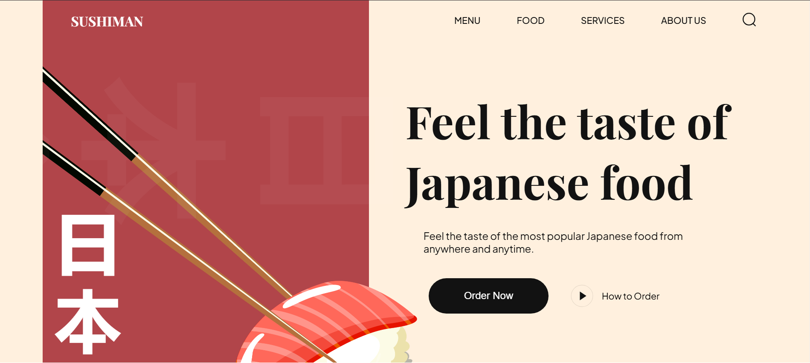

# 🍣 Sushiman - Japanese & Korean Cuisine Explorer

**Sushiman** is a beautifully designed static web application that allows users to explore various traditional **Japanese** and **Korean dishes**. It offers categorized food information with detailed descriptions, presented in a fully **responsive** and visually appealing UI.

---

## 🔗 Live Demo

👉 [Click here to view the live project](https://vercel.com/manish-kumars-projects-0e5cc1d5/sushiman/FG98GdKE3arneArF1QxMhxVAGFZq)

---

## 🖼️ Screenshot

> To display this screenshot, make sure you have the image saved at `screenshot/sushiman.png` in your repository.

---

## 🛠️ Tech Stack

- **HTML5** – Semantic structure
- **CSS3** – Styling and layout
- **JavaScript** – Interactivity and dynamic content

---

## 🌟 Features

- 🍜 Explore Japanese & Korean cuisines
- 🧾 View categorized dish lists
- 📄 See detailed descriptions of each dish
- 📱 Fully responsive design (Mobile, Tablet, Desktop)
- 🎨 Clean and modern UI for a pleasant experience

---
 

